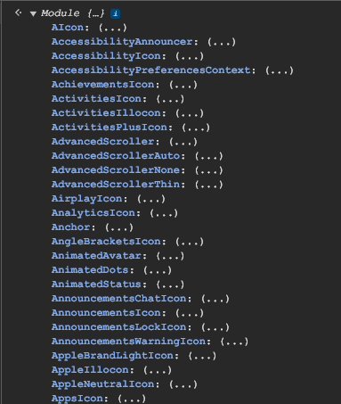
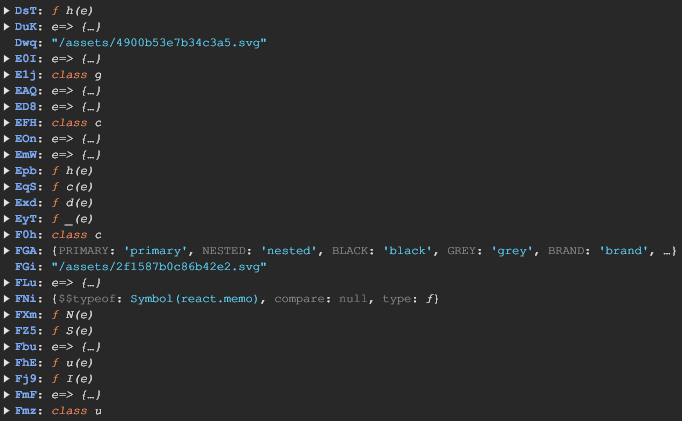

A recent Discord update broke a lot of client mods, including moonlight. This is a stressful situation to be in, as a whole chunk of moonlight users now had broken clients! Discord client modding moves exceptionally fast compared to other software or games, because updates happen up to several times a day on Canary.

The most important part about these huge breaking updates is to make people's experience have as little friction as possible. If you wanted to play some games with your friends and you opened your Discord client to a crash screen, that can ruin your mood and cause you to waste precious time getting things working. We try and move as fast as possible for this reason, while also offering people the ability to quickly unpatch moonlight if they need to.

We were able to fix moonlight **within the day**, which is a huge accomplishment for our team - out of the four moonlight core developers, only two were around to work on this! Thanks to several hours of almost non-stop effort, users on Discord Canary only had broken clients for a few hours, and users on Discord Stable only had broken clients for a few minutes.

## If it ain't broke, break it

The breaking change in question revolves around Discord's components. Discord uses [React](https://react.dev/) for the user interface, which represents parts of the UI as reusable components. Discord has a file in their source code that exports a lot of reused components (like buttons, sliders, text, and more). We gave this module the name of `discord/components/common/index`.

For years, we've been lucky with this module, as it contains the names of all of the components. Usually, Discord code is minified, which means most variable names are a small sequence of unreadable letters instead of proper names. This module wasn't minified, which means that we could refer to components by name like "Card" or "Checkbox" instead of "wGF" and "nn4".



However, this all changed with a Discord update - one that presumably updated [Rspack](https://rspack.dev/), their bundler of choice. This meant the components module now looked like this:



Not good! Almost every extension that interacted with the UI in some way was now broken, because the components it was trying to use couldn't be found. This meant that Discord crashed on startup, and Moonbase (the settings UI) was unavailable. Even our crash screen utilities broke, so the only way to fix your client was by updating through the system tray icon or opening the installer.

Not all hope was lost, though! A lucky part about this update was that we saw a lot of it coming. Discord tried to make this change several times over the past month, reverting it every time, so we always had a glimpse of what was broken and how to fix it.

Another good thing is that all of these components were imported through [mappings](https://github.com/moonlight-mod/mappings). Several months ago, we started a project to coordinate modules in the Discord client. This allows us to locate modules and give them stable names, but it also has a special superpower within it: it can take a module's exports and dynamically alias the export names.

This got us thinking: if we were to round up a list of most of the components that were used in moonlight extensions, and manually map them all, would everything just work without issue? It turns out, mostly, yes!

## Gotta map 'em all

This update was also pushed and reverted yesterday, so we had some time to map the components. We started by going to Discord Stable (where the update hadn't been released yet), and we created a mapping of component names to the function source (using a [JSON.stringify replacer](https://developer.mozilla.org/en-US/docs/Web/JavaScript/Reference/Global_Objects/JSON/stringify#replacer) to properly serialize it).

Next, we looked through moonlight's source code, along with a few other extensions in the official repository, and made a list of every component that was used. We combined this with the list of components that we had typed to get a good estimation of what we needed to fix.

This was only about ~100 components that needed to be mapped overall, which wasn't that bad. The process was easy, but tedious, as it involved getting creative with how to uniquely match the component. Let's break down the mapping process, starting with this example find:

```ts
moonmap.addExport(name, "NumberInputStepper", {
  type: ModuleExportType.Function,
  find: "__invalid_subtract"
});
```

Imagine that you worked at a moonlight factory producing Webpack module names (which is definitely a real place, don't ask any questions). As modules are loaded into the Discord client, a worker earlier on the factory line identifies a module as the one where the components are stored. Your job would be to take the exports of that module and press Ctrl+F on your keyboard to find the text `__invalid_subtract`.

JavaScript has a fun quirk where you can do `.toString()` on a function to get the source code of that function. This is how most of moonlight works at its core, and it works the same here. We loop through every single export, turn it into a string, and look for the find inside of it.

This process is automated to do it all in one go, completely dynamically. The module loads, it gets identified, and then its exports are scanned and remapped. The mappings sytem then emits a Webpack module with a unique name, and other modules can load it and use the components.

We had to add one small change to map these functions, which is that some components had their function inside of an object (e.g. when using [refs](https://react.dev/learn/manipulating-the-dom-with-refs), it would be `{ render: function }`). We just added a `recursive` setting to scan functions inside of objects.

There's also a few other mappings types, like this one:

```ts
moonmap.addExport(name, "ModalSize", {
  type: ModuleExportType.Key,
  find: "DYNAMIC"
});
```

The `ModalSize` object looks like this:

```json
{
  "SMALL": "small",
  "MEDIUM": "medium",
  "LARGE": "large",
  "DYNAMIC": "dynamic"
}
```

This looks for an export that is an object that has the key of `DYNAMIC` in it. It also can check for object values or key/value pairs.

After a lot of work, we were able to combine these techniques to map most of what was needed. Some components were unfortunately lost, though:

- Some were just removed directly in this update, and were no longer in the module at all. A lot of icons were unfortunately removed.
- Some were not unique enough to identify them by value alone. For example, `useModalsStore` has the function string of `e=>s(n,e)`, which is simply not unique enough to reliably match.
- Some are still in the file, but we didn't remap them yet. We tried our best to map everything that was used, but some things may be missing, and we'll be working on pushing out updates for the missing components that are wanted.

## Fixing functionality, fast

We became aware of the Discord update at around 6 pm UTC on the 28th, and had it fixed by about 7:30 pm UTC. We waited until 11 pm UTC to release our fixes to the moonlight nightly branch, as we were unsure if they would revert the update on Canary.

moonlight is split into two branches: Stable and Nightly. The Nightly branch is intended to be fast-paced development snapshots that matches closely with Discord Canary, and the Stable branch is intended to just work for users and match closely with Discord Stable.

We received word that Discord published the update with the relevant changes to Stable, so we began preparing for a moonlight release. Mere seconds away from releasing the update, Discord reverted their update on Stable! This meant that our `main` branch sat with a half-released update for a bit, so we had to wait until the morning after to fully release the update.

When we released the moonlight update for Canary (11 pm UTC), some other client mods were still broken. While it's uncertain if we were the first client mod to fix this, we were definitely fast about it! This is in part to our bet on mappings early on in the ecosystem, and how it's proven to be useful for these kinds of issues.

The extensions that had issues have already been updated, but most of them just worked out of the box without any changes. While some minor tweaks were required for Moonbase (our settings UI), most of it just started working after we had remapped the missing components!

While we can't guarantee this pace for other fixes in the future (especially because we had warnings ahead of time for this one), it's a nice look into how we handle breaking Discord updates, and our community's mindset on getting things working ASAP. As always, moonlight is a passion project, so don't expect us to be so fast in the future.
