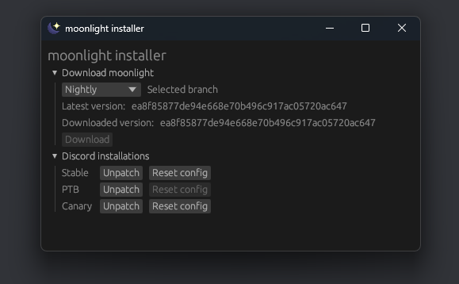
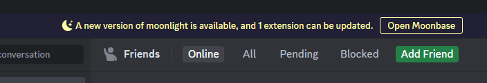
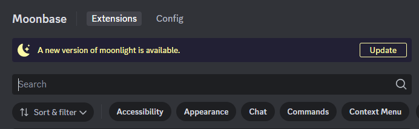
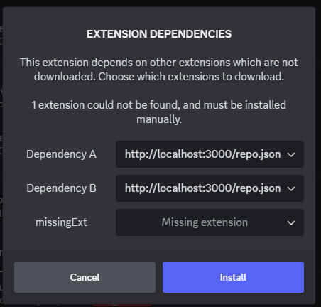

Right after releasing [moonlight API v2](/blog/moonlight-api-v2) we knew we wanted to work on more moonlight stuff. What was originally planned as a "1.1.1" kept growing in size until it was large enough that we decided to upgrade to a "1.2.0". We ended up making **over 100 commits in one week!**

With this release, the moonlight API version still stays at 2. Assuming your extension was up to date and functioning before, it should continue to be fine now.

Let's talk about all the new changes!

## Welcome to the new website

What you're reading right now wasn't what it was like before. The moonlight website and documentation is now powered by [Starlight](https://starlight.astro.build/), an [Astro](https://astro.build/)-based documentation site with an incredibly fitting name. We migrated from [Docusaurus](https://docusaurus.io/) since it's more modern, looks nicer, and builds faster. All the content is still the same, but some links might be broken.

We use the [starlight-blog](https://github.com/HiDeoo/starlight-blog) plugin for this blog. We even got a [new RSS feed](/blog/rss.xml) with it!

## Introducing rocketship, a custom Discord Linux build

Discord on Linux has been a notably bad experience for a while now. Several clients exist to make it an easier experience, but they don't support moonlight. So we made our own!

One of the biggest pain points is screensharing. The Discord client ships with two methods for voice connections: using WebRTC for browsers, and using their native Rust/C++ engine for desktop. The native engine support on Linux is quite bad, but WebRTC support can be better in some situations. Unfortunately, Discord's Electron build [disables](https://github.com/discord/electron/blob/32-x-y/patches/chromium/disable_getusermedia.patch) the [required APIs](https://developer.mozilla.org/en-US/docs/Web/API/MediaDevices/getUserMedia) for using the WebRTC engine on desktop.

While you can just use stock Electron for a custom client, Discord's modified Electron is desirable for its various fixes. We were able to [fork Discord's fork](https://github.com/moonlight-mod/discord-electron) and remove the patch we didn't want, keeping the others. After building Electron, we uploaded it as a GitHub release and wrote [rocketship](https://github.com/moonlight-mod/rocketship), a script to install it into Discord. rocketship downloads the official Discord Linux client, keeping its .asar and desktop entry, but removes the Electron binary and replaces it with our own.

rocketship is thus less of a packaged Discord distribution and more of an installer. rocketship can be used without moonlight, but you don't gain any of its benefits without using moonlight. The moonlight rocketship extension can force Discord to use the WebRTC APIs and then use [venmic](https://github.com/Vencord/venmic) to connect audio.

rocketship is still very experimental, but we encourage Linux users to try it out and report any issues!

## A new installer, and a new CLI

[The moonlight installer](https://github.com/moonlight-mod/moonlight-installer) was rewritten, along with a new CLI project. Instead of using Tauri, we moved to [egui](https://github.com/emilk/egui) for the UI.



Our motivation for moving from Tauri is that it's rough to use. Linux support is flakey (we had many issues on Wayland), packaging for Windows required an installer for the installer because of WebViews, and it was just extremely heavy for a tool that needed to download some files and extract them somewhere. With egui, the moonlight installer is a single self-contained ~5 MB .exe (minus Visual C++ Redistributables).

In the process of rewriting the installer, we had to write publishing scripts for macOS and Linux. This turned out to be in a very sorry state, as most tools to create .dmg and .AppImage files are kinda bad. We ended up having to abandon Linux AppImage support because of glibc issues, and wrote our own macOS bundle script. Linux users can build the GUI installer from source, but we encourage [using the CLI](/using/install#moonlight-cli):

```shell
./rocketship.sh -b stable
moonlight-cli install stable
moonlight-cli patch ~/.local/share/Discord/Discord
```

A very special thank you to [Emma/InvoxiPlayGames](https://github.com/InvoxiPlayGames) for PRing macOS CI scripts, and [Eva](https://github.com/xyzeva) for the original installer & macOS support. PRs for Linux AppImage support will be accepted in the future, if anyone is willing to help.

## Moonbase UX improvements, and updating moonlight from Discord

Moonbase now has a notice that displays at the top of the screen when updates are available. Moonbase can check for updates to moonlight, as well as updates for the extensions you have installed.



When in Moonbase, this prompt will show at the top of the page, allowing you to update moonlight with a single click from inside Discord:



Moonbase can also prompt you when you install an extension with a missing dependency. If an extension is present in multiple sources, you can pick which one to install. This makes it easier to make your own libraries on custom repositories and make sure they're installed with your extension.



While making these improvements, we introduced a new notice library for showing custom messages, with as many buttons as you like and custom styling. It even supports multiple notices being queued!

## moonlight now runs in the browser

moonlight now has experimental support to [run as a browser extension](/using/install#browser). We used [ZenFS](https://www.npmjs.com/package/@zenfs/core) to create a local filesystem in the browser, allowing you to install and load extensions like normal. This was planned since May(!), but it needed some final touches for extension installation and core loading. The browser extension works both in Chrome and Firefox, with support for Manifest V2 and Manifest V3.

The browser extension has to block Discord from loading so we can load first, given that moonlight is asynchronous and we can't easily tell the page to wait for us. To solve this, the extension blocks Discord's JavaScript files from loading, loads moonlight, and then unblocks the scripts and reloads them. Clever!

## Squashing bugs and making new ones

We made a lot of fixes and improvements this release, with a focus on Moonbase, the extension manager GUI for moonlight. Here's what we were up to:

- Implicitly enabled extensions will [show as enabled in Moonbase](https://github.com/moonlight-mod/moonlight/pull/63), to prevent confusion with libraries
- Added the [Rocketship](https://github.com/moonlight-mod/moonlight/pull/70) extension for better Linux support when using rocketship
- Extension descriptions can [use more advanced Markdown formatting](https://github.com/moonlight-mod/moonlight/issues/71)
- Added [declarative URL blocking](https://github.com/moonlight-mod/moonlight/pull/76)
- Fixed a bug relating to [duplicated extensions](https://github.com/moonlight-mod/moonlight/pull/80)
- Added the [Native Fixes](https://github.com/moonlight-mod/moonlight/pull/81) extension
- Extensions from local search paths [show up clearly](https://github.com/moonlight-mod/moonlight/pull/82)
- Extensions properly show up in Moonbase [when they are missing metadata](https://github.com/moonlight-mod/moonlight/issues/86)
- moonlight [no longer makes a mess in the global scope](https://github.com/moonlight-mod/moonlight/pull/88)
- [Nix support was improved](https://github.com/moonlight-mod/moonlight/pull/89), adding a module for home-manager
- [The filesystem was abstracted](https://github.com/moonlight-mod/moonlight/pull/91) to make porting extensions to the browser easy
- Installed extensions on different API levels [properly show up in Moonbase](https://github.com/moonlight-mod/moonlight/issues/92)
- Extensions can [specify their compatible environments](https://github.com/moonlight-mod/moonlight/pull/101), now that browser support exists
- Extensions can [register custom settings pages](https://github.com/moonlight-mod/moonlight/pull/103)
- The sample extension now contains [a script to clean build output](https://github.com/moonlight-mod/sample-extension/issues/3)

## Bringing in a new core developer

We welcomed [redstonekasi](https://github.com/redstonekasi) to the core developer team. Kasi has done exceptional work improving Moonbase and maintaining moonlight through the year, along with making lots of extensions in the official repository. The title of "core developer" doesn't change much with their access, but we want to recognize their efforts. Thanks!

## That's all for now

That's everything we've got for moonlight 1.2. Development might slow down for a bit, as a *lot* of work has gone into maintenance & experimenting with new projects, so what remains is mostly extension work. As always, we encourage developers to [try making extensions](/ext-dev/getting-started) and [submitting them to the official repository](/ext-dev/official-repository) if they wish - more extensions can always help.

Thanks for using moonlight!
